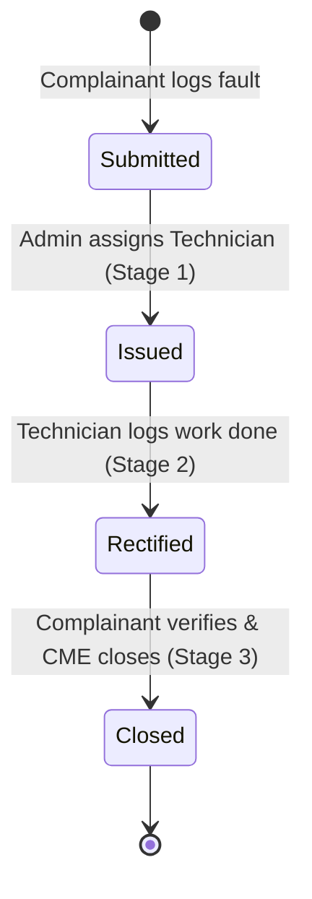

# CampusDocket Pro: Enterprise Academic Fault-Tracking & Facility Maintenance System

**Comprehensive Technical Specification, Feature Breakdown & Presentation Guide**

---

## 1. Executive Summary & Abstract

### Abstract
Modern educational institutions, sprawling engineering campuses, and residential hostels face significant operational bottlenecks in managing facility infrastructure. Traditional paper-based complaint registers or fragmented communication channels (e.g., messaging apps) lead to delayed rectification, lack of accountability, lost work orders, and zero auditability. 

**CampusDocket Pro** is an enterprise-grade, Role-Based Access Control (RBAC) driven digital fault tracking and facility maintenance management system designed specifically for academic institutions. It bridges the gap between complainants (students/faculty), maintenance technicians, and campus estate administration (Chief Maintenance Engineer / CME). By digitizing the entire maintenance lifecycle—from initial fault logging with rich media attachments to 3-stage workflow tracking, real-time analytics, and formal single-page physical docket generation—CampusDocket Pro ensures complete transparency, rapid resolution, and an unalterable digital audit trail.

---

## 2. Core System Architecture

```mermaid
flowchart TD
    subgraph Frontend [React 18 / Vite SPA]
        UI[Glassmorphism UI & Navigation]
        Dash[Analytics Dashboard]
        WF[3-Stage Workflow Modal]
        Print[Single-Page Print Replica]
    end

    subgraph Backend [Express REST API]
        APIDockets[/api/dockets]
        APIDepts[/api/departments]
        APICats[/api/categories]
        APITechs[/api/technicians]
    end

    subgraph Persistence [JSON Persistence]
        DB[db.json Archive]
    end

    UI --> Dash & WF & Print
    Dash & WF --> APIDockets & APIDepts & APICats & APITechs
    Print -->|Dynamic QR Code| QRCodeReact[qrcode.react]
    APIDockets & APIDepts & APICats & APITechs <--> DB
```

### Technology Stack
- **Frontend Architecture**: React 18 Single Page Application (SPA) powered by Vite for lightning-fast Hot Module Replacement (HMR) and optimized production bundling.
- **Styling & Design System**: Modern Vanilla CSS incorporating an elegant HSL-tailored palette (`--bg-main`, `--primary-blue`, `--deep-navy`), sleek glassmorphism effects, and fully responsive CSS grid/flexbox layouts.
- **Backend Service**: Express.js REST API providing robust CRUD operations across four primary domain models.
- **Database / Persistence**: File-based JSON persistence (`db.json`) ensuring lightweight, portable, and instantaneous state management without heavy database overhead.
- **Specialized Integrations**: `qrcode.react` for high-fidelity, dynamic SVG/Canvas QR code generation directly within the DOM.

---

## 3. Comprehensive Feature Breakdown

### A. Role-Based Access Control (RBAC)
The system implements strict, granular permission boundaries tailored to three distinct campus personas:
1. **Admin / Chief Maintenance Engineer (CME)**: Full system access. Can receive/issue dockets, assign technicians, log rectification work, verify closure, and manage campus departments, categories, and technician rosters.
2. **Maintenance Technician**: Task-focused access. Can view assigned dockets, review fault descriptions/images, and log detailed rectification work performed.
3. **Complainant (Students/Faculty)**: Self-service access. Can file new fault dockets, attach proof images, track live status, and provide final verification remarks for docket closure.

### B. Dynamic Department & Category Administration
- **Department/Hostel Roster**: Administrators can dynamically add or remove campus departments and hostel blocks (e.g., *Computer Science & Engineering*, *Boys Hostel Block A*).
- **Specialized Fault Categories**: Categorization management allowing custom fault natures (e.g., *Electrical & Wiring*, *Plumbing & Water Supply*, *Carpentry & Furniture*).
- **Technician Roster**: Dedicated management of maintenance personnel, tracking names and specialized skill sets.

### C. The 3-Stage Progression Lifecycle
Every fault docket follows a rigorous, transparent operational lifecycle:

- **Stage 1 (Receipt & Issue)**: Admin acknowledges the complaint, selects an appropriate specialized technician from the roster, and officially issues the work order.
- **Stage 2 (Fault Rectification)**: The technician performs the physical repair and logs comprehensive technical details of the work done (e.g., *Replaced 32A MCB and tightened busbar wiring*).
- **Stage 3 (User Verification & Closure)**: The complainant verifies that the equipment/facility is fully functional, enters closing remarks, and secures the final Site Engineer (CME) sign-off.

### D. Rich Media Attachment & Image Preview
- Complainants can attach high-resolution fault images during complaint submission.
- The workflow timeline modal features a dedicated, beautifully framed image preview box (`.image-preview-box`) allowing technicians and administrators to inspect physical damage prior to dispatching personnel.

### E. Enterprise Analytics Dashboard
- **Metric Cards**: Real-time KPI summary cards displaying counts for *Submitted*, *Issued*, *Rectified*, and *Closed* dockets, complete with status-specific color coding and subtle micro-animations.
- **Department Breakdown**: Dynamic visual bar charts illustrating fault distribution across various academic departments and residential hostels.
- **Priority & Category Distribution**: Instant visibility into urgent maintenance requests and top recurring fault categories.

### F. Masterclass Physical Docket Replica (Single-Page Print Optimization)
To satisfy formal administrative and auditing requirements, CampusDocket Pro includes an official printable work order sheet:
- **Formal Government/Academic Aesthetics**: Features an elegant double-bordered header (`SDM COLLEGE OF ENGINEERING & TECHNOLOGY, DHARWAD - OFFICIAL FAULT-DOCKET`), distinct shaded metadata grids, and crisp section boxing.
- **Compact Single-Page Guarantee**: Advanced CSS `@media print` rules strip out all application wrappers, sidebars, and navigation bars (`display: none !important`), remove height restrictions (`max-height: none !important`), and compress margins/padding to ensure the entire document fits flawlessly on a single A4 sheet.
- **Dynamic QR Code Verification**: Integrates `qrcode.react` to render a high-fidelity SVG QR code encoding the live docket tracking URL (`window.location.origin/docket/ID`). This allows auditors or supervisors to scan the physical sheet with a mobile device for instant digital verification.
- **Dynamic PDF Naming**: Automatically injects a structured filename (`Docket_[ID]_[Category]_[Timestamp].pdf`) into `document.title` right before printing, ensuring saved PDFs are perfectly organized without manual renaming.

---

## 4. Presentation Guide (For PPT & Reports)

When preparing PowerPoint slides or executive reports, structure your presentation using the following thematic flow:

### Slide 1: Title Slide
- **Headline**: CampusDocket Pro
- **Sub-headline**: Enterprise Academic Fault-Tracking & Facility Maintenance System
- **Talking Points**: Introduce the project as a modern, digital solution to campus infrastructure management.

### Slide 2: The Campus Challenge (Problem Statement)
- **Bullet Points**:
  - Paper-based complaint registers in hostels and departments suffer from lost records and zero accountability.
  - Delayed communication between complainants, estate managers, and field technicians.
  - Lack of high-level analytics for campus administrators to track recurring infrastructure failures.
- **Visual**: Contrast a messy paper register with the clean CampusDocket Pro dashboard.

### Slide 3: The CampusDocket Pro Solution
- **Bullet Points**:
  - A centralized, digital portal providing role-based access for Students/Faculty, Technicians, and Admin.
  - End-to-end digital lifecycle tracking with rich media fault attachments.
  - Instantaneous analytics and automated physical work order generation.

### Slide 4: Role-Based Access Control (RBAC) Architecture
| Persona | Key Permissions | Dashboard View |
| :--- | :--- | :--- |
| **Admin / CME** | Full CRUD, Department/Technician Setup, Docket Issuing & Final Closure | Global Analytics + Roster Management |
| **Technician** | View Assigned Dockets, Inspect Images, Log Rectification Details | Task-Oriented Workflow Modal |
| **Complainant** | File Dockets, Upload Images, Track Status, Provide Verification Remarks | Self-Service Tracking Portal |

### Slide 5: The 3-Stage Operational Lifecycle
- **Visual**: Use the 3-stage progression flowchart.
- **Talking Points**: Emphasize how each stage creates a clear digital timestamp and requires specific user accountability, eliminating ambiguity regarding who handled the repair and when.

### Slide 6: Official Physical Docket & QR Audit Trail
- **Bullet Points**:
  - Generates a formal, government/academic-compliant single-page A4 work order.
  - **Dynamic QR Code**: Scannable via smartphone to instantly pull up the live digital record, audit log, and original high-resolution fault attachment.
  - **Smart PDF Naming**: Automatically titles exported documents with the docket ID, fault category, and exact timestamp.

### Slide 7: Conclusion & Future Roadmap
- **Talking Points**: Summarize the operational efficiency gained by the institution. Mention potential future enhancements such as automated email/SMS notifications and AI-driven predictive maintenance analytics.

---

## 5. System Verification & Testing Script

To verify all features during a live demonstration or audit, follow this standard testing script:

1. **Role Switching**: Use the top-right RBAC dropdown to switch between *Admin*, *Technician*, and *Complainant*. Observe how restricted notices appear for unauthorized actions.
2. **Filing a Docket**: As a Complainant, navigate to "File New Docket", fill in sample details, attach an image URL, and submit.
3. **Stage 1 (Issue)**: Switch to *Admin*, open the newly created docket, select a technician, and click "Confirm Receipt & Issue Docket".
4. **Stage 2 (Rectify)**: Switch to *Technician*, open the docket, enter rectification details (e.g., "Fixed wiring"), and click "Mark as Rectified".
5. **Stage 3 (Close)**: Switch to *Admin* or *Complainant*, enter user remarks and CME approval name, and click "Verify & Close Fault-Docket".
6. **Print & PDF Export**: Click the "Physical Docket Replica" tab, verify the beautiful single-page layout and QR code, click "Print Official Docket", and observe the dynamic PDF filename in the print prompt.
